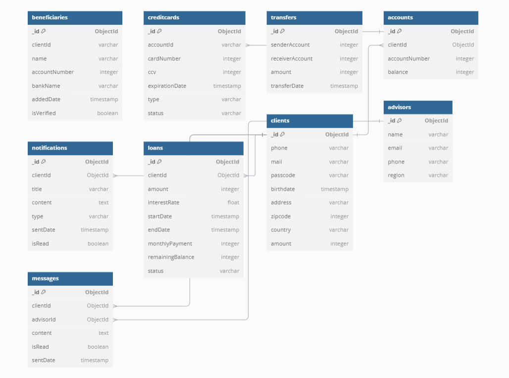

# NestJS Bank API

Cette API bancaire est construite avec NestJS et utilise MongoDB comme base de données.

## DiagramDB

Présentation des tables de la base de données



## Prérequis

Avant d'installer et d'exécuter ce projet, assurez-vous d'avoir installé :
- [Node.js](https://nodejs.org/) (version 16+ recommandée)
- [Git](https://git-scm.com/)

## Installation

1. Clonez le dépôt :
   ```sh
   git clone https://github.com/FLIzze/bank_api
   cd bank_api
   ```

2. Installez les dépendances :
   ```sh
   npm install
   ```

3. Créez un fichier `.env` à la racine du projet et ajoutez les variables d'environnement (reçu sur teams).

4. Démarrez l'application en mode développement :
   ```sh
   npm run start:dev
   ```

## Démarrer en production

Pour exécuter l'API en mode production, utilisez :
```sh
npm run build
npm run start:prod
```

## Endpoints disponibles

L'API expose plusieurs routes pour gérer les comptes bancaires et les transactions. Une documentation Swagger est disponible à l'adresse suivante une fois le serveur démarré :
```
http://localhost:3000/doc#
```
